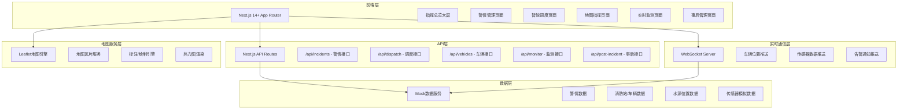
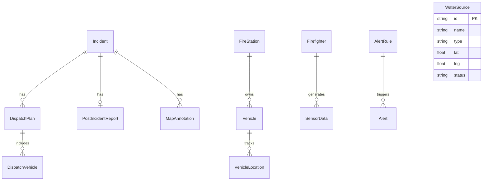

## 1. 架构设计



## 2. 技术说明

- **前端框架**：Next.js 14+ (App Router架构)
- **UI组件库**：Tailwind CSS + shadcn/ui
- **地图引擎**：Leaflet + react-leaflet (开源免费，无需API Key)
- **图表库**：Recharts (数据可视化)
- **实时通信**：WebSocket (基于自定义Hook封装)
- **状态管理**：Zustand (轻量级全局状态)
- **数据持久化**：前端Mock数据 + localStorage (可扩展对接PostgreSQL+PostGIS)
- **动画库**：framer-motion (页面过渡与微交互)
- **热力图**：leaflet.heat 插件
- **图标**：lucide-react

## 3. 路由定义

| 路由 | 用途 | 布局 |
|------|------|------|
| `/` | 指挥总览大屏 | 全屏沉浸式 |
| `/incidents` | 警情管理列表页 | 侧边导航+主内容 |
| `/incidents/new` | 新建警情录入页 | 侧边导航+主内容 |
| `/incidents/[id]` | 警情详情页 | 侧边导航+主内容 |
| `/dispatch` | 智能调度页 | 侧边导航+主内容 |
| `/map` | 数字化地图指挥页 | 全屏地图+浮动面板 |
| `/monitor` | 实时数据监测页 | 侧边导航+主内容 |
| `/post-incident` | 事后数据管理列表 | 侧边导航+主内容 |
| `/post-incident/[id]` | 事后数据录入页 | 侧边导航+主内容 |

## 4. API定义

### 4.1 警情接口

```typescript
interface Incident {
  id: string;
  location: {
    address: string;
    lat: number;
    lng: number;
  };
  buildingType: "residential" | "factory" | "mall" | "warehouse" | "other";
  customBuildingType?: string;
  floor: number;
  isBasement: boolean;
  trappedCount: number;
  trappedLocation: string;
  fireLevel: "small" | "medium" | "large" | "fierce";
  status: "pending" | "dispatched" | "responding" | "on_scene" | "under_control" | "resolved";
  createdAt: string;
  updatedAt: string;
}

// POST /api/incidents - 创建警情
// GET /api/incidents - 查询警情列表(支持分页/筛选)
// GET /api/incidents/[id] - 查询警情详情
// PUT /api/incidents/[id] - 更新警情
```

### 4.2 调度接口

```typescript
interface FireStation {
  id: string;
  name: string;
  location: { lat: number; lng: number };
  distance: number;
  estimatedArrival: number;
  vehicles: Vehicle[];
}

interface Vehicle {
  id: string;
  name: string;
  type: "water_tanker" | "ladder" | "rescue" | "command" | "foam";
  status: "available" | "dispatched" | "en_route" | "on_scene" | "returning";
  currentLocation: { lat: number; lng: number };
  estimatedArrival?: number;
}

interface DispatchPlan {
  id: string;
  incidentId: string;
  stations: FireStation[];
  vehicles: { vehicleId: string; type: string; count: number }[];
  createdAt: string;
  status: "draft" | "confirmed" | "executing" | "completed";
}

// GET /api/dispatch/recommend?incidentId=xxx - 获取推荐调度方案
// POST /api/dispatch/confirm - 确认调度方案
// GET /api/dispatch/vehicles - 查询车辆状态
```

### 4.3 监测接口

```typescript
interface SensorData {
  firefighterId: string;
  name: string;
  location: { lat: number; lng: number };
  temperature: number;
  gasConcentrations: {
    co: number;
    co2: number;
    h2s: number;
    ch4: number;
  };
  heartRate: number;
  timestamp: string;
}

interface AlertRule {
  id: string;
  type: "temperature" | "gas" | "heartRate";
  threshold: number;
  operator: "gt" | "lt" | "eq";
  severity: "warning" | "critical";
  enabled: boolean;
}

// GET /api/monitor/sensor-data - 获取传感器数据
// GET /api/monitor/alerts - 获取告警列表
// WebSocket ws://host/monitor - 实时数据推送
```

### 4.4 事后管理接口

```typescript
interface PostIncidentReport {
  id: string;
  incidentId: string;
  propertyLoss: number;
  casualtyInfo: {
    deaths: number;
    injuries: number;
    rescued: number;
  };
  fireCause: {
    category: "electrical" | "arson" | "chemical" | "natural" | "cooking" | "smoking" | "other";
    description: string;
  };
  summary: string;
  createdAt: string;
}

// POST /api/post-incident - 创建事后报告
// GET /api/post-incident - 查询事后报告列表
// GET /api/post-incident/[id] - 查询事后报告详情
// PUT /api/post-incident/[id] - 更新事后报告
```

## 5. 数据模型

### 5.1 数据模型定义



### 5.2 数据定义语言（Mock数据结构）

本项目采用前端Mock数据方案，数据存储在内存和localStorage中，API Routes返回模拟数据。数据结构定义如下：

```sql
-- 警情表
CREATE TABLE incidents (
  id UUID PRIMARY KEY DEFAULT gen_random_uuid(),
  address TEXT NOT NULL,
  lat DECIMAL(10,7) NOT NULL,
  lng DECIMAL(10,7) NOT NULL,
  building_type VARCHAR(20) NOT NULL,
  custom_building_type VARCHAR(50),
  floor INTEGER NOT NULL,
  is_basement BOOLEAN DEFAULT FALSE,
  trapped_count INTEGER DEFAULT 0,
  trapped_location TEXT,
  fire_level VARCHAR(10) NOT NULL,
  status VARCHAR(15) DEFAULT 'pending',
  created_at TIMESTAMPTZ DEFAULT NOW(),
  updated_at TIMESTAMPTZ DEFAULT NOW()
);

-- 消防站表
CREATE TABLE fire_stations (
  id UUID PRIMARY KEY DEFAULT gen_random_uuid(),
  name TEXT NOT NULL,
  lat DECIMAL(10,7) NOT NULL,
  lng DECIMAL(10,7) NOT NULL,
  address TEXT,
  created_at TIMESTAMPTZ DEFAULT NOW()
);

-- 车辆表
CREATE TABLE vehicles (
  id UUID PRIMARY KEY DEFAULT gen_random_uuid(),
  station_id UUID REFERENCES fire_stations(id),
  name TEXT NOT NULL,
  type VARCHAR(20) NOT NULL,
  status VARCHAR(15) DEFAULT 'available',
  current_lat DECIMAL(10,7),
  current_lng DECIMAL(10,7),
  created_at TIMESTAMPTZ DEFAULT NOW()
);

-- 水源表
CREATE TABLE water_sources (
  id UUID PRIMARY KEY DEFAULT gen_random_uuid(),
  name TEXT NOT NULL,
  type VARCHAR(20) NOT NULL,
  lat DECIMAL(10,7) NOT NULL,
  lng DECIMAL(10,7) NOT NULL,
  status VARCHAR(10) DEFAULT 'available',
  created_at TIMESTAMPTZ DEFAULT NOW()
);

-- 事后报告表
CREATE TABLE post_incident_reports (
  id UUID PRIMARY KEY DEFAULT gen_random_uuid(),
  incident_id UUID REFERENCES incidents(id),
  property_loss DECIMAL(12,2),
  deaths INTEGER DEFAULT 0,
  injuries INTEGER DEFAULT 0,
  rescued INTEGER DEFAULT 0,
  fire_cause_category VARCHAR(20),
  fire_cause_description TEXT,
  summary TEXT,
  created_at TIMESTAMPTZ DEFAULT NOW(),
  updated_at TIMESTAMPTZ DEFAULT NOW()
);

-- PostGIS空间索引（生产环境）
-- CREATE INDEX idx_incidents_geo ON incidents USING GIST(ST_Point(lng, lat));
-- CREATE INDEX idx_water_sources_geo ON water_sources USING GIST(ST_Point(lng, lat));
```
